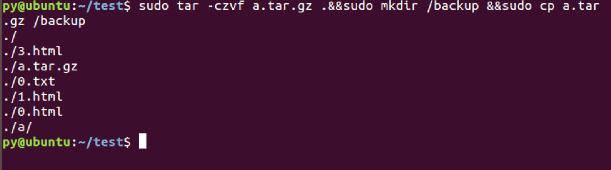
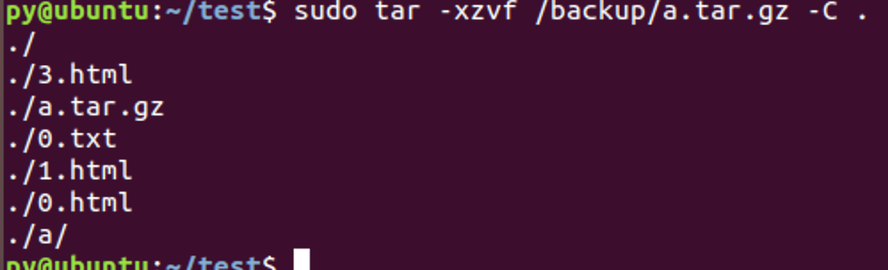
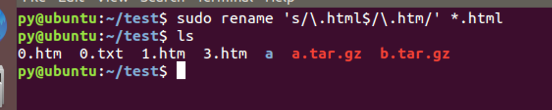
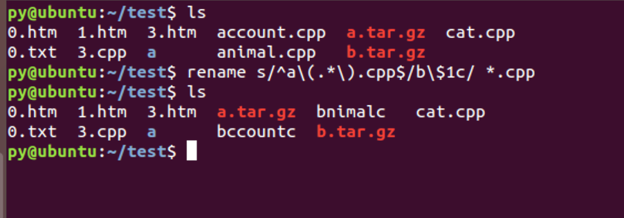
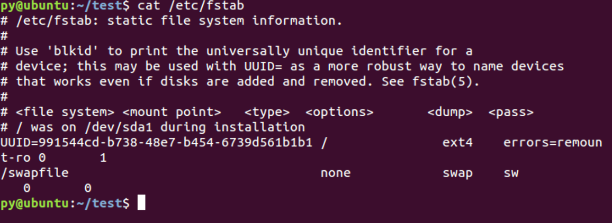
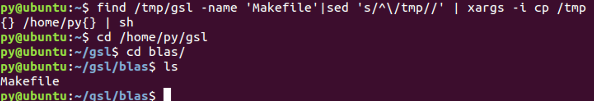

# 作业1

**161250096 潘羽**

## 1.用命令完成以下功能（写出对应的命令，要求命令尽可能简单[能一行命令完成的尽量一行命令完成, 不能使用课上教的Shell脚本或者编程方法]）

a)将当前目录下所有文件备份并压缩成tar.gz，如果成功再将备份拷贝到/backup目录下。

    tar -czvf a.tar.gz .&&mkdir /backup&&cp a.tar.gz /backup

b) 将上述备份压缩后的文件解压到原来的目录

    tar -xzvf /backup/a.tar.gz -C . 

c) 将当前目录下所有后缀为.html的文件的后缀改为.htm。

    rename 's/\.html$/\.htm/' *.html

d）将当前目录下所有子目录下以a开头的.cpp文件改名为以b开头的.c文件

    rename s/^a\(.*\)\.cpp$/b\$1c/ *.cpp

**rename实质是多条命令的拼凑，变量替换需要遵从shell的$1而非\1**

## 2.自己查阅Linux相关书籍资料，学习并完成以下作业题：

a) 请简要叙述DOS/Windows中的文本文件，UNIX/Linux中的文本文件以及Mac中的文本文件有何不同之处，并给出至少一种你认为较为实用的转换方案。(需要两两给出转换方案)

**主要的区别在于换行符不同**

- UNIX格式，每行的行尾都是用一个0x0a字符（换行字符LF）表示的
- 而在WINDOWS/DOS下每行的行尾都是用0x0d 0x0a两个字符（回车字符CR，换行字符LF）表示的，
- MAC机，老版本每行的行尾都是0x0d字符表示，即回车字符CR，而在OSX版本及以上是和Unix一致，为LF

|OS|Characters|Name|
|--|--|--|
|Unix|\n|LF|
|Mac|\r|LF(Mac OS up to version 9 and OS-9)/CR(Mac OS old version)|
|Windows|\r\n|CRLF|

**这里在转换文本只考虑老版本的mac系统，使用sed逐行替换文本**

<table>
    <tr>
        <th>Source/Aim </th>
        <th>WINDOWS</th>
        <th>UNIX</th>
        <th>MAC</th>
    </tr>
    <tr>
    <th align="left">WINDOWS</th>
    <th>\</th>
    <th><pre>sed 's/^M$//'</pre></th>
    <th><pre>tr -d '\n' mac_file win_file</pre></th>
    </tr>
    <tr>
    <th align="left">UNIX</th>
    <th><pre>sed 's/$/^M/'</pre></th>
    <th>\</th>
    <th><pre>tr '\n' '\r' unix_file mac_file</pre></th>
    </tr>
    <tr>
    <th align="left">MAC</th>
    <th><pre>tr '\n' '\r' mac_file win_file</pre></th>
    <th><pre>tr '\r' '\n' mac_file unix_file</pre></th>
    <th>\</th>
    </tr>
</table>

b) 请查阅Linux系统中/etc/fstab文件各字段功能，并对你自己安装的Linux系统中/etc/fstab的各个字段做出解释

/etc/fstab 文件包含了如下字段，通过空格或 Tab 分隔：

- file system - 要挂载的分区或存储设备.
- dir - 的挂载位置。
- type - 要挂载设备或是分区的文件系统类型，支持许多种不同的文件系统：ext2, ext3, ext4, reiserfs, xfs, jfs, smbfs, iso9660, vfat, ntfs, swap 及 auto。 设置成auto类型，mount 命令会猜测使用的文件系统类型，对 CDROM 和 DVD 等移动设备是非常有用的
- options - 挂载时使用的参数，注意有些mount 参数是特定文件系统才有的。一些比较常用的参数有：
    - auto - 在启动时或键入了 mount -a 命令时自动挂载
    noauto - 只在你的命令下被挂载
    - exec - 允许执行此分区的二进制文件
    - noexec - 不允许执行此文件系统上的二进制文件
    - ro - 以只读模式挂载文件系统
    - rw - 以读写模式挂载文件系统
    - user - 允许任意用户挂载此文件系统，若无显示定义，隐含启用 noexec, nosuid, nodev 参数
    - users - 允许所有 users 组中的用户挂载文件系统.
    - nouser - 只能被 root 挂载
    - owner - 允许设备所有者挂载.
    - sync - I/O 同步进行。
    - async - I/O 异步进行。
    - dev - 解析文件系统上的块特殊设备。
    - nodev - 不解析文件系统上的块特殊设备。
    - suid - 允许 suid 操作和设定 sgid 位。这一参数通常用于一些特殊任务，使一般用户运行程序时临时提升权限。
    - nosuid - 禁止 suid 操作和设定 sgid 位。
    - noatime - 不更新文件系统上 inode 访问记录，可以提升性能(参见 atime 参数)。
    - nodiratime - 不更新文件系统上的目录 inode 访问记录，可以提升性能(参见 atime 参数)。
    - relatime - 实时更新 inode access 记录。只有在记录中的访问时间早于当前访问才会被更新。（与 noatime 相似，但不会打断如 mutt 或其它程序探测文件在上次访问后是否被修改的进程。），可以提升性能(参见 atime 参数)。
    - flush - vfat 的选项，更频繁的刷新数据，复制对话框或进度条在全部数据都写入后才消失。
    - defaults - 使用文件系统的默认挂载参数，例如 ext4 的默认参数为:rw, suid, dev, exec, auto, nouser, async.
- dump: dump 工具通过它决定何时作备份. dump 会检查其内容，并用数字来决定是否对这个文件系统进行备份。 允许的数字是 0 和 1 。0 表示忽略， 1 则进行备份。大部分的用户是没有安装 dump 的 ，对他们而言应设为 0。
- pass: fsck 读取pass的数值来决定需要检查的文件系统的检查顺序。允许的数字是0, 1, 和2。 根目录应当获得最高的优先权 1, 其它所有需要被检查的设备设置为 2. 0 表示设备不会被 fsck 所检查。

1. 忽略#的注释信息
2. 第一行信息表明/dev/sda1在/目录下，分区文件系统是ext4，errors=remount -ro 表明出现错误会以只读重新挂载(read only)，没有安装dump为0，作为根目录有最高优先权为1
3. 第二行表明开机挂载交换分区，不被挂载，只是交换，sw指自动挂载的可读写分区，没有安装dump为0，后一个0表示设备不会被 fsck 所检查。

c) 用命令行实现： 从光盘制作一个.iso文件，如果成功将光盘弹出

    dd if=/dev/cdrom of=/backup/a.iso && umount /dev/cdrom && eject

## 附加题：

假设当前Linux系统的目录/tmp/gsl下的文件结构如下图所示，其中有很多Makefile分散在各个子目录下(但并非每个子目录都存在Makefile，例如block目录下就没有)。

要求将这些Makefile拷贝到目录/home/usrname/gsl的对应子目录下(假设/home/usrname/gsl下已经存在blas，bspline等子目录)，使得拷贝后/home/usrname/gsl下的文件如下图所示：

*要求：该要求实际上是可以用一行命令完成的，难度较高。同学们实际做作业时，允许使用两到三行命令，但不允许使用任何编程实现(即不允许Shell脚本的循环，分支等控制流程，可以使用管道)。

*提示：利用find，sed和sh命令。

**我测试命令正确性性用的是我的用户名py，下为一般性的usrname**

    find /tmp/gsl -name 'Makefile'|sed 's/^\/tmp//' | xargs -i cp /tmp{} /home/usrname{} | sh

1. 截取了需要的子路径

  <pre>find /tmp/gsl -name 'Makefile' | sed 's/^\/tmp//'  
  </pre> 

2. 正常替换拷贝即可

## Reference

1. https://blog.csdn.net/u014696921/article/details/56673532
2. https://stackoverflow.com/questions/2372719/using-sed-to-mass-rename-files
3. https://blog.csdn.net/richerg85/article/details/17917129
4. https://www.cnblogs.com/zwgblog/p/6013975.html
5. https://leemendelowitz.github.io/blog/remove-carriage-return-control-character.html